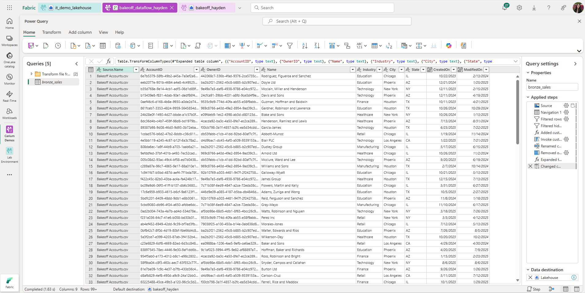

Azure Fabric Setup (Week 1)
Scope: Azure Fabric only. Stand up workspace + lakehouse, land structured Sales data in Bronze, store HR PDFs in Files, and document RBAC (design-only due to shared workspace).
Workspace: bakeoff_hayden
Lakehouse: bakeoff_hayden
Tables: bronze_sales (596 rows, 9 columns)
Files: HR PDFs under /Files/raw/pdf/hr-docs/

Steps Completed
Workspace created → bakeoff_hayden
Lakehouse created → bakeoff_hayden (SQL endpoint available)
Folder structure added (Lakehouse → Files):
/Files/raw/csv/hr/
/Files/raw/csv/sales/
/Files/raw/pdf/hr-docs/
Sales CSV ingested via Dataflow Gen2 → saved as table bronze_sales (596 rows, 9 columns)
Validated with SQL in the Lakehouse SQL endpoint:
SELECT TOP 10 * FROM bronze_sales;
Uploaded HR PDFs into /Files/raw/pdf/hr-docs/
RBAC roles documented (design-only; shared workspace) → see ../governance/rbac-matrix.xlsx
 or ../governance/rbac-matrix.md

 ## Screenshots

- **Bronze Sales table preview**  
  

- **File Explorer showing HR PDFs**  
  

- **Dataflow steps (Power Query / destination to Lakehouse)**  
  

Status
✅ Fabric setup complete for Week 1 sprint
Workspace + Lakehouse created
Bronze Sales table ingested and validated
HR PDFs uploaded
RBAC roles documented (design-only)

Notes / Constraints
Shared workspace → could not modify Workspace or Lakehouse item permissions; RBAC is documented for later enforcement.
OneLake Shortcuts not enabled (admin rights required); optional for later.

bakeoff_hayden/
  fabric/
    dataflows/
      bronze_sales.json
    lakehouse/
      bronze_sales_validation.sql
    README.md
  governance/
    rbac-matrix.xlsx
    rbac-matrix.md
  docs/
    10-azure-fabric-setup.md
    bronze_sales.png
    hr_pdfs.png
    dataflow_steps.png
  README.md
