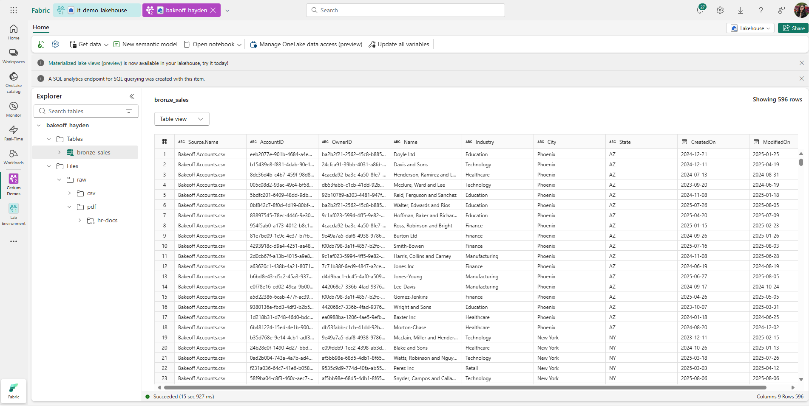
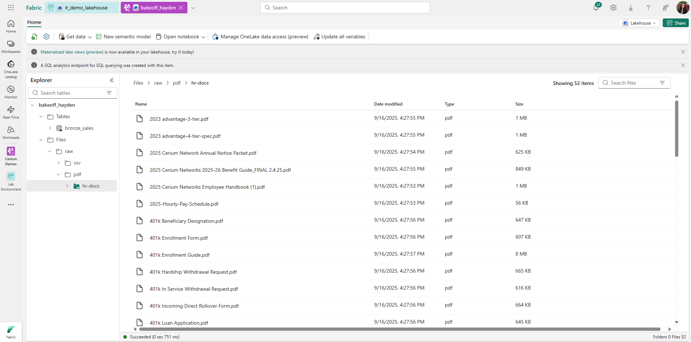

Azure Fabric Setup (Week 1)
Scope: Azure Fabric only. Stand up workspace + lakehouse, land structured Sales data in Bronze, store HR PDFs in Files, and document/apply RBAC where possible.
Workspace: bakeoff_hayden
Lakehouse: bakeoff_hayden
Tables: bronze_sales (596 rows, 9 columns)
Files: HR PDFs under /Files/raw/pdf/hr-docs/

Steps Completed
Workspace created → bakeoff_hayden
Lakehouse created → bakeoff_hayden (SQL endpoint available)
Folder structure added under Lakehouse → Files:
/Files/raw/csv/hr/
/Files/raw/csv/sales/
/Files/raw/pdf/hr-docs/
Built Dataflow Gen2 pipeline and ingested Sales CSV → saved as table bronze_sales (596 rows, 9 columns).
Validated ingestion in the Lakehouse SQL endpoint using:
SELECT TOP 10 * FROM bronze_sales;
Uploaded HR PDFs into /Files/raw/pdf/hr-docs/.

RBAC roles:
Workspace-level RBAC (Admin, Member, Contributor, Viewer) documented only → see ../governance/rbac-matrix.xlsx or ../governance/rbac-matrix.md (permissions could not be modified in shared workspace).
Lakehouse-level RBAC roles (Admin, Engineer, Analyst, Service) created and assigned to validate least-privilege design inside the Lakehouse.

 ## Screenshots

- **Bronze Sales table preview**  
  

- **File Explorer showing HR PDFs**  
  

- **Dataflow steps (Power Query / destination to Lakehouse)**  
  

Status
✅ Fabric setup complete for Week 1 sprint
Workspace + Lakehouse created
Bronze Sales table ingested and validated
HR PDFs uploaded
RBAC roles documented at workspace level (design-only)
RBAC roles created and applied at Lakehouse level (Admin, Engineer, Analyst, Service)

Notes / Constraints

Shared workspace → workspace-level roles (Admin, Member, Contributor, Viewer) could only be documented, not applied.
Lakehouse-level RBAC was available and configured, but enforcement is limited to Lakehouse objects (tables, files).
OneLake Shortcuts not enabled (admin rights required); optional for later.

bakeoff_hayden/
  fabric/
    dataflows/
      bronze_sales.json
    lakehouse/
      bronze_sales_validation.sql
    README.md
  governance/
    rbac-matrix.xlsx
    rbac-matrix.md
  docs/
    10-azure-fabric-setup.md
    bronze_sales.png
    hr_pdfs.png
    dataflow_steps.png
  README.md
