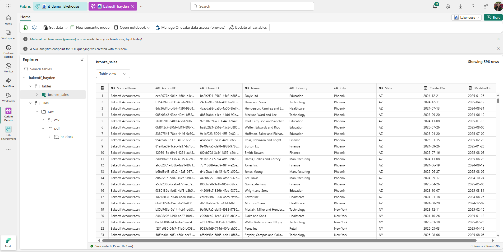
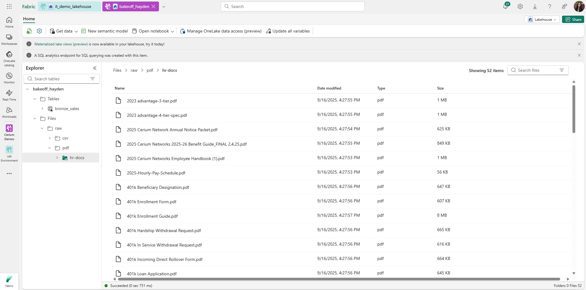
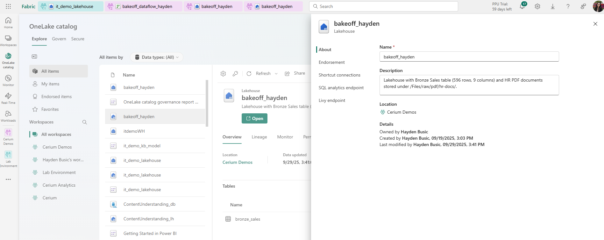
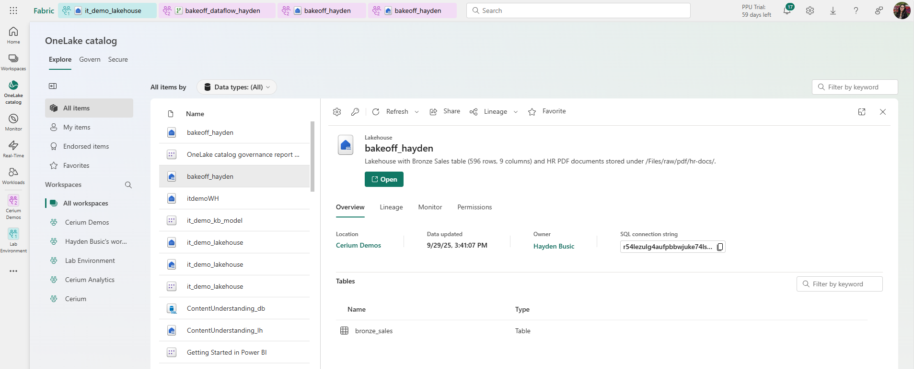

# Azure Fabric Setup – Week 2

## Scope
Governance tasks in Microsoft Fabric: verify data ingestion, confirm catalog, add metadata, review governance insights, and document limitations.

## Steps Completed
1. Verified Bronze Sales table exists in Lakehouse (596 rows, 9 columns).
2. Verified HR PDFs uploaded in /Files/raw/pdf/hr-docs/.
3. Confirmed Bronze Sales table visible in OneLake Catalog.
4. Added description metadata to Lakehouse.
5. Checked Govern tab insights and captured coverage.
6. Documented limitations where tenant features unavailable.

## Screenshots
- Bronze Sales table in Lakehouse  

- HR PDFs in File Explorer  

- Lakehouse Description

- OneLake Catalog view with Bronze Sales  

- Govern tab insights  
[OneLake Catalog Governance Report](./OneLake%20catalog%20governance%20report%20(automatically%20generated)%20(1).pdf)

## Limitations
- Run scans to auto-discover tables: ❌ not available (Purview-only).
- Assign glossary terms: ❌ not available in tenant.
- Apply sensitivity labels: ❌ not enabled (requires MIP + admin).
- Endorsement and Tags: ❌ not enabled in workspace.

✅ Governance simulated with descriptions, catalog validation, and Govern tab insights.

## Status
- Week 2 Fabric deliverables complete.
